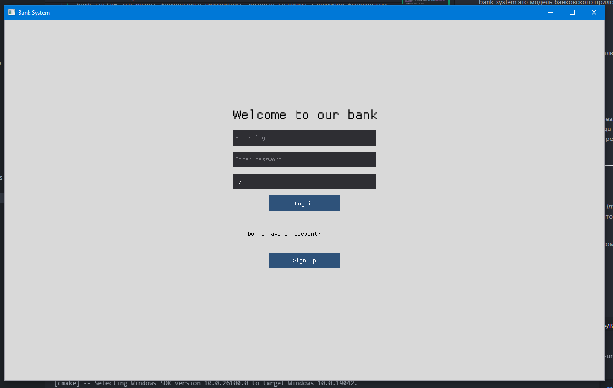
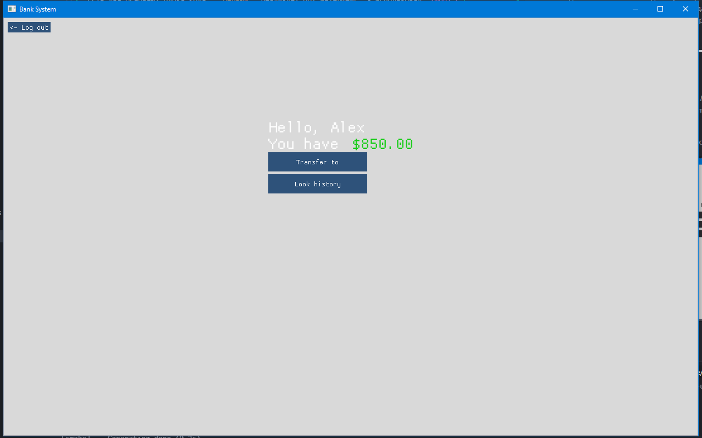
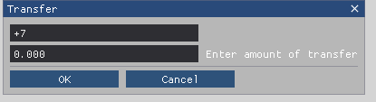
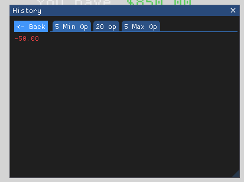
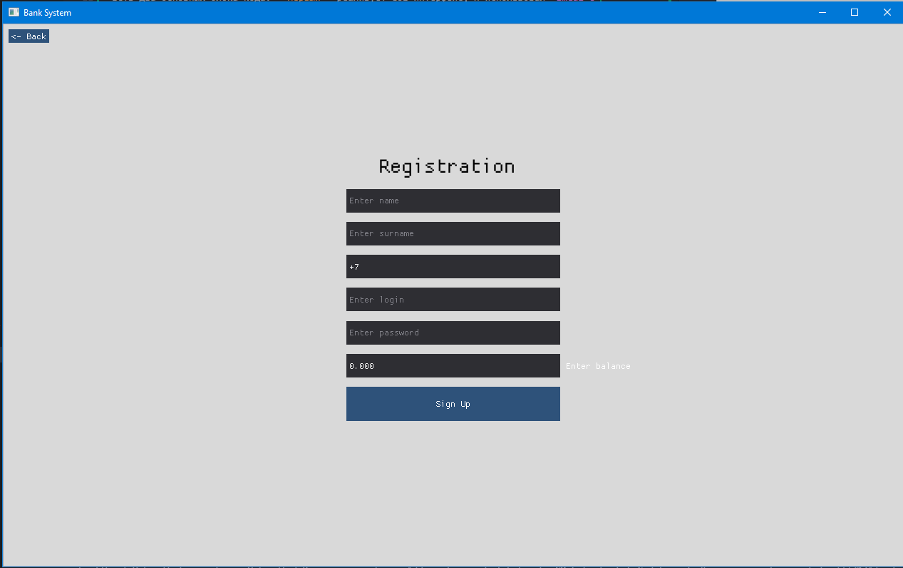

# BankSystem


Проект представляет собой десктопное банковское приложение с раздельной архитектурой Frontend/Backend, реализованное на C++. Программа пока что моделирует только банковские переводы, вход/создание аккаунта и работает с локальной реляционной базой данных.
___

## 💡 Функционал приложения
+ **Аутентификация:** Регистрация новых пользователей и вход в личный кабинет.
+ **P2P-Переводы:** Перевод внутренней виртуальной валюты между аккаунтами.
+ **История транзакций:** Логирование и просмотр истории всех финансовых операций пользователя. 
##  🛠 Технологический стек
+ **Язык разработки:** C++ (Стандарт C++17 / C++20)
+ **Система сборки:** CMake
+ **Графический интерфейс (Frontend):** Dear ImGui
+ **База данных:** SQLite3
___

## GUI bank_system
Как писалось выше я использовал *ImGui*. *ImGui* это библиотека для создания GUI, которая находится в открытом доступе на GitHub [Dear ImGui Git](https://github.com/ocornut/imgui).

Приведу несколько скринов с интрефейсом:



*окно входа*


*личный кабинет*



*окно для перевода*



*история операции*


*окно регистрации*

___


## 🗄 Структура базы данных (SQLite3)
В проекте используются две основные таблицы с установленными внешними ключами для обеспечения целостности данных:
+ **bank_user**: Хранит данные аккаунтов (*phone*, name, surname, login, password).
+ **history_operation**: Логирует операции на счёте (id, *phone*, type, category).

## 🏛 Архитектурные компоненты (C++)

Логика бэкенда сосредоточена в трех основных классах:
* **`BankSystem`**: Главный управляющий класс (ядро системы). Отвечает за жизненный цикл соединения с БД (`sqlite3*`), аутентификацию, регистрацию новых пользователей и проведение транзакций.
* **`Account`**: Модель банковского аккаунта пользователя. Хранит персональные данные (ФИО, логин, хэшированный/открытый пароль), номер телефона (используется как уникальный идентификатор) и текущий баланс.
* **`Operation`**: Модель финансовой операции. Хранит информацию о сумме, типе транзакции, категории расходов и привязанном номере телефона.
```cpp
class BankSystem {
private:
	sqlite3* db;
public:
	std::string bank_name;
	BankSystem();
	BankSystem(const std::string& name);
	BankSystem(const char* filename, const std::string& name);
	~BankSystem();

	std::unique_ptr<Account> FindAccountByPhone(const std::string& phn_num);
	[[nodiscard]]  int EnterAccount(const std::string& phn_num, const std::string& lgn, const std::string& passd);
	[[nodiscard]]  int TransferMoney(const std::string& from_phone, const std::string& to_phone, float amount);
	[[nodiscard]]  int CreateAccount(Account&& new_acc);
	void PrintUserList();
	void GetHistoryList(std::multimap<float, TypeOperation>& history, const std::string& phone_num, int lim = 15);
};
```
```cpp
class Account {
private:
	std::string login;
	std::string password;
	std::string name;
	std::string surname;
	float balance = 0.0;

public:
	Account();


	Account(std::string new_login, std::string new_password, std::string phone_num, std::string new_name, std::string new_surname, float new_balance);

	std::string phone_number;
	std::string GetLogin() const;
	bool CheckPassword(const std::string& pass) const;
	std::string GetName() const;
	std::string GetSurname() const;
	float GetBalance() const;
	std::string GetPassword() const;

	bool SetLogin(const std::string& new_login);
	bool SetPassword(const std::string& new_password);
	bool SetName(const std::string& new_name);
	bool SetSurname(const std::string& new_surname);
	bool SetBalance(float amount);
};
```


```cpp
enum TypeOperation {
	transfer_in,
	transfer_out,
	purchase,
};

enum CategoryOperation {
	entertainment,
	education, 
	food, 
	utilities, 
	transport,
	medical,
	housing,
	other
};

class Operation {
public:
	int id;
	float sum;
	std::string phone;
	TypeOperation type;
	CategoryOperation category;

	Operation(int new_id, float new_sum, std::string new_phone, TypeOperation new_type, CategoryOperation new_category);
};

```


---

## 🚀 Сборка и запуск

### 📋 Требования к окружению
* **Язык разработки:** С++ (Рекомендуется **C++17** / **C++20** для поддержки атрибутов `[[nodiscard]]`, `[[maybe_unused]]`, `[[unlikely]]`, `[[likely]]`) (если запускаете ниже ниже 20 версии то в файле CmakeList.txt измените строчку `set(CMAKE_CXX_STANDARD 20)` под вашу версию).
* **Система сборки:** CMake версии 3.16 или выше.

**Важно:** Приложение разработано с использованием **WinAPI** и графического бэкенда **DirectX 11**, поэтому поддерживается сборка и запуск **строго на ОС Windows**.
### Инструкция по сборке

1. Клонируйте репозиторий:
   ```bash
   git clone https://github.com/nikonovbogdan987/bank_system
   cd bank_system
   ```

2. Создайте директорию для сборки:
   ```bash
   mkdir build
   ```

3. Сгенерируйте файлы сборки и скомпилируйте проект:
   ```bash
   cmake -S . -B build
   cmake --build build
   ```

4. Запустите приложение:
   ```bash
   .\build\debug\banksystem.exe
   ```